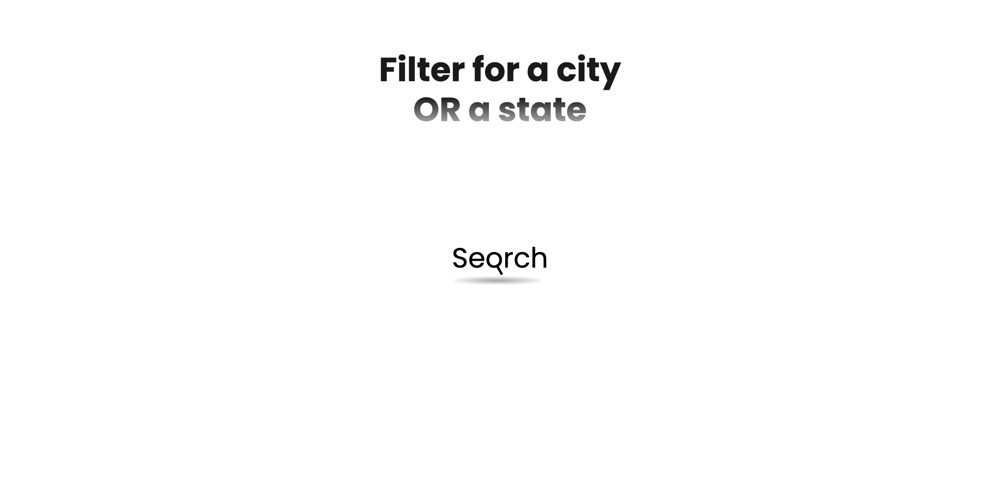
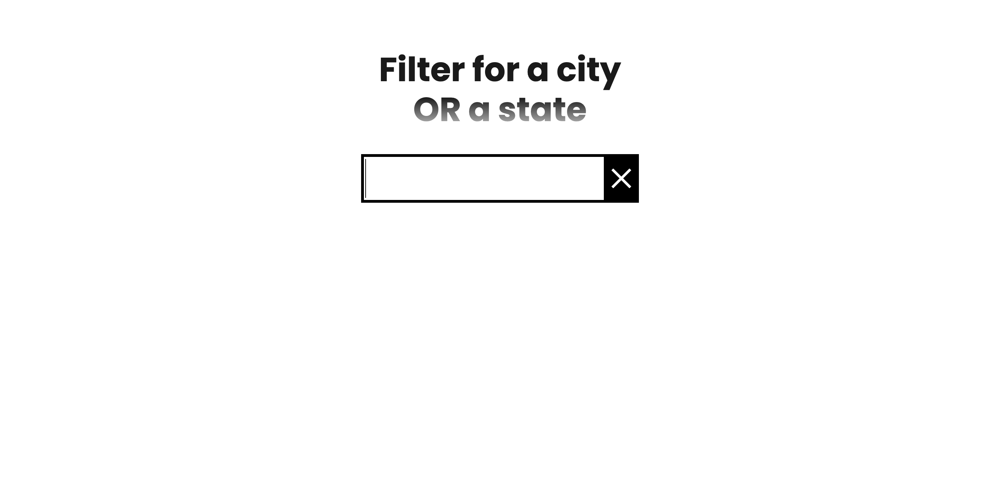
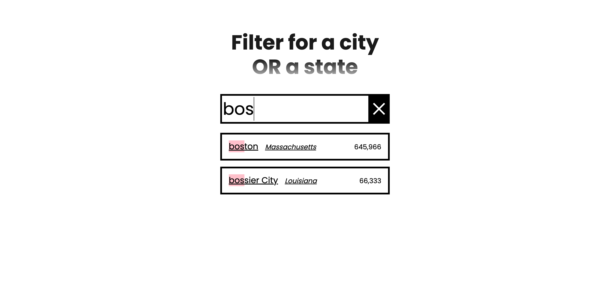

# 06-Ajax-type-ahead

## Table of contents
  - [Overview](#overview)
    - [The challenge](#the-challenge)
    - [Screenshot](#screenshot)
    - [Links](#links)
  - [My process](#my-process)
    - [Built with](#built-with)
    - [What I learned](#what-i-learned)
    - [Continued development](#continued-development)
    - [Useful resources](#useful-resources)
  - [Author](#author)
  - [Acknowledgments](#acknowledgments)

## Overview
### The challenge
Users should be able to:
- View the optimal layout depending on their device's screen size.
- Search keyword for cities and states.

### Screenshot

### Links
- [My Github-JS30-06-Ajax-type-ahead](https://github.com/Beginneraboutlife116/JS30-06-Ajax-typed-head)
- [Live Site URL](https://beginneraboutlife116.github.io/JS30-06-Ajax-typed-head/)

## My process
### Built with

- Semantic HTML5 markup
- CSS custom properties
- Flexbox
- Mobile-first workflow

### What I learned
This is my first time for using `fetch` API which is native in JavaScript.

### Useful resources

- [Fetch API](https://developer.mozilla.org/en-US/docs/Web/API/Fetch_API)
- [Using the Fetch API](https://developer.mozilla.org/en-US/docs/Web/API/Fetch_API/Using_Fetch)

## Author

- [Wei Kai](https://github.com/Beginneraboutlife116)